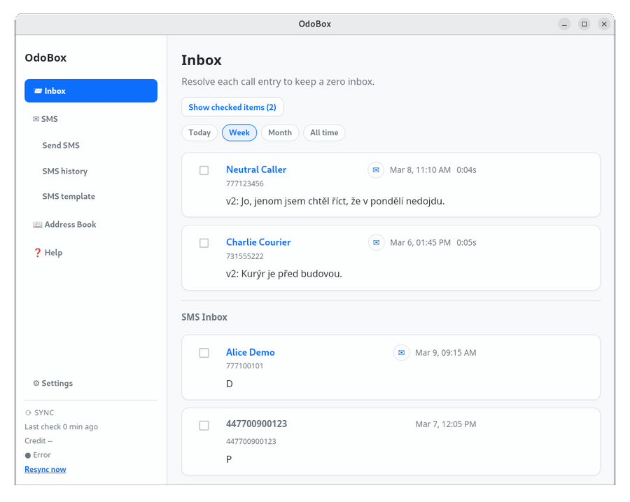

# OdoBox

OdoBox is a desktop app for working with voicemail and SMS from [Odorik](https://www.odorik.cz/).

It downloads Odorik voicemail and SMS email notifications, stores them locally, and gives you a simple interface for:

- browsing voicemail transcripts
- reviewing received SMS
- sending SMS
- managing contacts and SMS templates

For development notes and build commands, see [README_dev.md](/home/paja/data/src/odorik_central/odorik-wails/OdorikCentral/README_dev.md).
